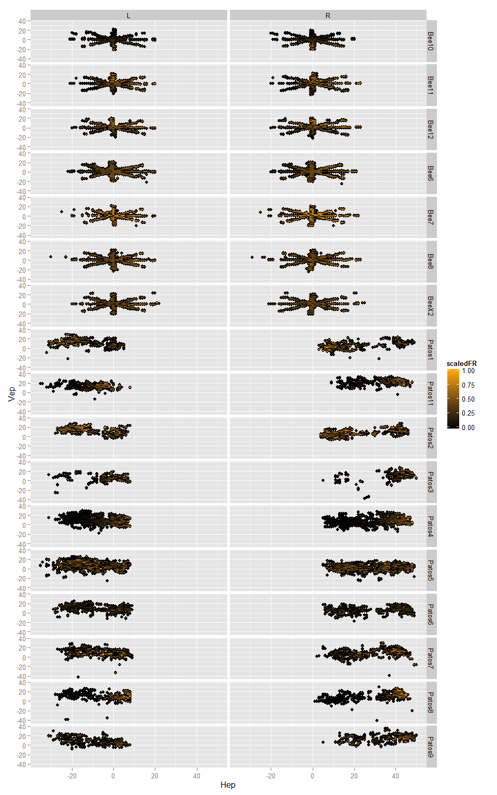
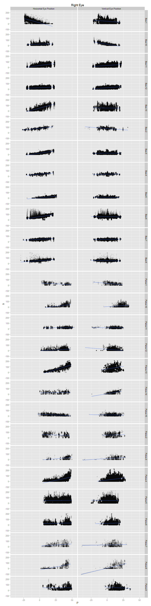
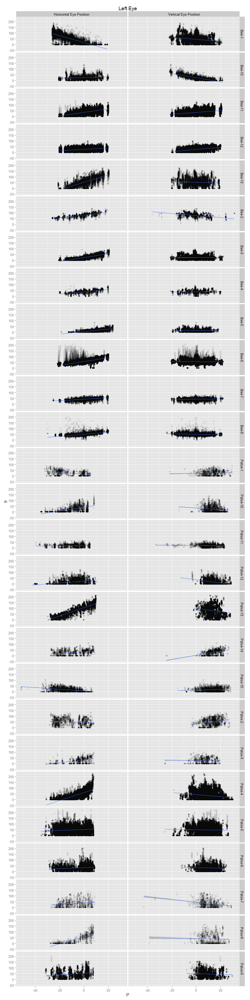

# NPH rate position analysis
Adam  
October 5, 2015  


```r
library(ggplot2)
library(dplyr)
library(knitr)
library(tidyr)
```


```r
#load all the .csv files in the data folder, then add a column naming the neuron, 
#using the file name as the default name, then put them all together in one long data frame
path<-"~/GitHub/NPH-Analysis/data/"
files <- list.files(path=path,pattern='*.csv')
t<-data.frame()
for (i in 1:length(files)) {
  temp <- read.csv(paste(path,files[i],sep=''))
  temp$neuron<-gsub('.csv','',files[i])
  t <-rbind(t,temp)
}
```

First I will plot the average firing rate of the neuron while the eyes are in various positions. I've restricted my analysis to periods when the eyes are not in motion using a simple eye velocity threshold. I require both the vertical and horizontal eye position to be less than one. This allows for pre-movement burst activity to potentially interfere with the static analysis. 


```r
thresh=1.5 #points with velocity below threshold are considered fixation

#choose just the points of fixation, then bin the data into 1 degree bins (using round)
#and calculate the mean firing rate during all the times when the eye is at each position
t %>%
  filter(abs(rev)<thresh,abs(revV)<thresh,abs(lev)<thresh,abs(levV)<thresh) %>%
  mutate(R.Hep=round(rep),R.Vep=round(repV), L.Hep=round(lep),L.Vep=round(lepV)) %>%
  group_by(R.Hep,R.Vep,L.Hep,L.Vep,neuron) %>%
  summarize(fr=mean(sdf)) %>%
  ungroup(.) %>%
  #use tidyr functions to make columns for eye (left or right), vertrical and horizontal eye position
  mutate(time=row_number(fr)) %>%
  gather(temp,P,1:4) %>%
  separate(temp,c("Eye","HV")) %>%
  spread(HV,P) ->
  s
levels(s$Eye)<-c("Right Eye","Left Eye") #Change R/L into Right Eye/Left Eye
```


```r
#Just show cells I want
#s <- filter(s,neuron %in% c("Bee6","BeeX1","BeeX2","BeeX3a","BeeX3b","BeeY1","BeeZ1"))
#s <- filter(s,neuron %in% c("Bee6","BeeZ1"))

#Create a scaled firing rate by simply dividing by the maximum firing rate in any bin
s %>%
  group_by(neuron) %>%
  mutate(maxFR=max(fr),scaledFR=fr/maxFR) ->
  ss

#plot
qplot(Hep,Vep,data=ss,fill=scaledFR)+geom_tile()+facet_grid(neuron~Eye)+
  scale_fill_gradient(low='black',high='orange')
```

 

Next, let's show the rate position curves for horizontal and vertical individually.


```r
t %>%
  filter(abs(rev)<thresh,abs(revV)<thresh,abs(lev)<thresh,abs(levV)<thresh) %>%
  select(1,2,4,6,8,10) %>%
  rename(R.Hep=rep,R.Vep=repV, L.Hep=lep,L.Vep=lepV,fr=sdf) %>%
  #use tidyr functions to make columns for eye (left or right), vertrical and horizontal eye position
  mutate(time=row_number(fr))%>%
  gather(temp,P,2:5) %>%
  separate(temp,c("Eye","HV")) ->
  static
```


```r
static$plotHV<-as.factor(static$HV)
levels(static$plotHV)<-c("Horizontal Eye Position","Vertical Eye Position")

static %>%
  filter(Eye=="R") %>%
  qplot(P,fr,data=.)+facet_grid(neuron~plotHV)+
  ggtitle('Right Eye')+
  stat_smooth(method='lm')
```

 


```r
static %>%
  filter(Eye=="L") %>%
  qplot(P,fr,data=.)+facet_grid(neuron~plotHV)+
  ggtitle('Left Eye')+
  stat_smooth(method='lm')
```

 

Next, I will create a table of the linear regression coefficients for the formula $$F_r=b+k_hE_h + k_hE_v$$, where $E_h$ and $E_v$ are the horizontal and vertical eye positions during periods where the eye velocity is less than 1.5. 


```r
static %>% 
  select(-plotHV) %>%
  spread(HV,P) %>%
  filter(Eye =="R") %>%
  group_by(neuron) %>%
  do(r.h.slope=summary(lm(fr~Hep+Vep,data=.))$coefficients[2],r.v.slope=summary(lm(fr~Hep+Vep,data=.))$coefficients[3]) %>%
  mutate(r.angle=atan2(r.v.slope,r.h.slope)*180/pi)->
  r

static %>% 
  select(-plotHV) %>%
  spread(HV,P) %>%
  filter(Eye =="L") %>%
  group_by(neuron) %>%
  do(l.h.slope=summary(lm(fr~Hep+Vep,data=.))$coefficients[2],l.v.slope=summary(lm(fr~Hep+Vep,data=.))$coefficients[3]) %>%
  mutate(l.angle=atan2(l.v.slope,l.h.slope)*180/pi)->
  l

rl<-left_join(r,l,by="neuron")
rl<-rl[c(1,2,3,5,6,4,7)] #rearrange columns 
kable(rl)
```


neuron   r.h.slope    r.v.slope     l.h.slope     l.v.slope          r.angle       l.angle
-------  -----------  ------------  ------------  ------------  ------------  ------------
Bee10    0.1800969    -1.937002     0.1470745     -1.797811       -84.688073    -85.323187
Bee11    1.469062     0.788065      1.541067      0.8797986        28.210922     29.722136
Bee12    0.5284778    0.8859174     0.5571954     0.9543114        59.182583     59.720554
Bee6     1.735839     -0.05681147   1.649801      -0.05552225      -1.874538     -1.927499
Bee7     0.6158252    0.1529736     0.6461562     0.1642704        13.950157     14.263958
Bee8     0.8226882    -0.2534351    0.8486388     -0.222565       -17.121828    -14.695501
Bee9     0.3358553    -0.07143891   0.3489107     -0.06770831     -12.008268    -10.982110
Patos1   -0.3932655   -0.5568464    -0.8835133    -0.2871528     -125.231152   -161.995195
Patos2   -0.747143    1.359032      -0.06232936   1.321568        118.800293     92.700251
Patos4   2.293573     0.576631      3.440755      -0.1134202       14.112345     -1.888000
Patos5   0.1240371    -0.1737813    0.3982019     -0.1098076      -54.482495    -15.416656
Patos9   0.2074481    -0.8128656    0.7667854     0.3766382       -75.683369     26.159861
