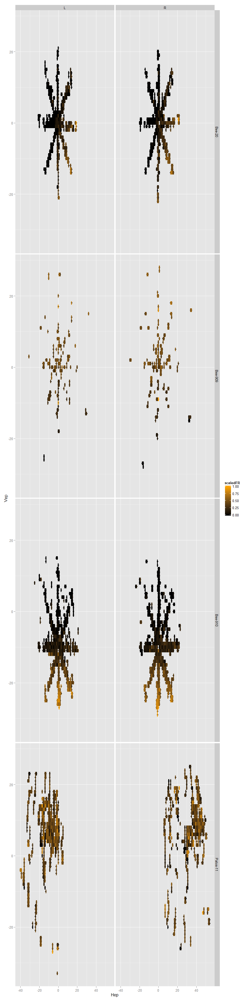
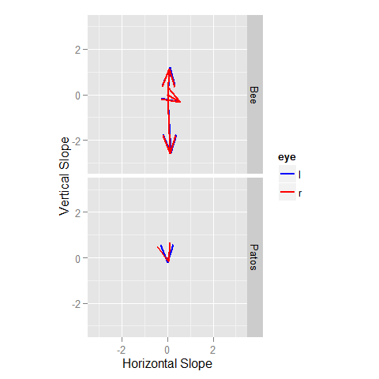
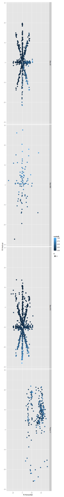
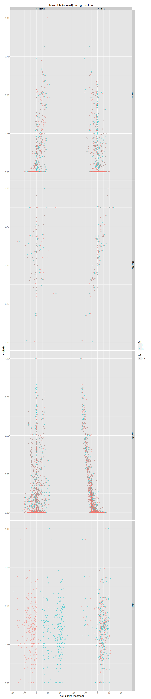
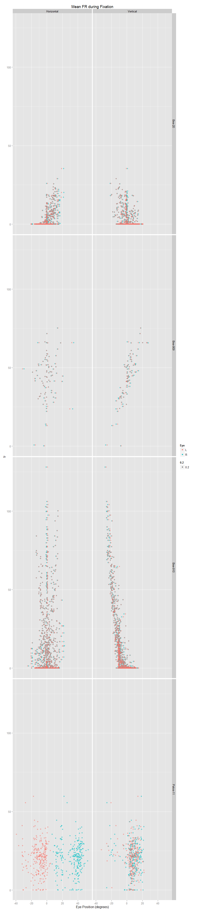

# NPH rate position analysis
Adam  
October 12, 2015  

First I will plot the average firing rate of the neuron while the eyes are in various positions. I've restricted my analysis to periods when the eyes are not in motion using a simple eye velocity threshold. I require both the vertical and horizontal eye position to be less than one. This allows for pre-movement burst activity to potentially interfere with the static analysis. 

 

Next, let's show the rate position curves for horizontal and vertical individually.

 

 

Next, I will create a table of the linear regression coefficients for the formula $$F_r=b+k_hE_h + k_hE_v$$, where $E_h$ and $E_v$ are the horizontal and vertical eye positions during periods where the eye velocity is less than 1.5. 

animal   cellnum     r.h.slope    r.v.slope       r.h.p       r.v.p        r.angle    l.h.slope    l.v.slope       l.h.p       l.v.p        l.angle
-------  --------  -----------  -----------  ----------  ----------  -------------  -----------  -----------  ----------  ----------  -------------
Bee      1          -3.2557624   -1.1109927   0.0000000   0.0000000   -161.1583638   -3.0424059   -1.0384265   0.0000000   0.0000000   -161.1543268
Bee      2           1.1179710   -0.2336401   0.0000000   0.0000000    -11.8041138    1.1363488   -0.2182694   0.0000000   0.0000000    -10.8729201
Bee      3           1.7297457    0.0061028   0.0000000   0.0741130      0.2021458    1.7385816    0.0634959   0.0000000   0.0000000      2.0916068
Bee      4           0.9724506    0.0697156   0.0000000   0.0000000      4.1005570    0.9745674    0.1055582   0.0000000   0.0000000      6.1817702
Bee      5           1.0584261   -0.1012155   0.0000000   0.0000000     -5.4624872    1.0738576   -0.1266763   0.0000000   0.0000000     -6.7277346
Bee      6           1.7358386   -0.0568115   0.0000000   0.0000000     -1.8745381    1.6498010   -0.0555222   0.0000000   0.0000000     -1.9274992
Bee      7           0.6158252    0.1529736   0.0000000   0.0000000     13.9501570    0.6461562    0.1642704   0.0000000   0.0000000     14.2639585
Bee      8           0.8226882   -0.2534351   0.0000000   0.0000000    -17.1218278    0.8486388   -0.2225650   0.0000000   0.0000000    -14.6955014
Bee      10          0.1800969   -1.9370015   0.0000000   0.0000000    -84.6880726    0.1470745   -1.7978107   0.0000000   0.0000000    -85.3231867
Bee      11          1.4690625    0.7880650   0.0000000   0.0000000     28.2109224    1.5410674    0.8797986   0.0000000   0.0000000     29.7221359
Bee      12          0.5284778    0.8859174   0.0000000   0.0000000     59.1825835    0.5571954    0.9543114   0.0000000   0.0000000     59.7205536
Bee      13          3.1294937   -0.1583377   0.0000000   0.0000000     -2.8964272    3.1766290   -0.0760979   0.0000000   0.0000036     -1.3722894
Bee      14          1.7036903   -0.1748511   0.0000000   0.0000000     -5.8597947    1.7361650   -0.1499904   0.0000000   0.0000000     -4.9376261
Bee      15          3.3745413   -0.0967607   0.0000000   0.0000000     -1.6424332    3.4470774   -0.0065862   0.0000000   0.6183466     -0.1094721
Bee      16          1.1425182   -0.0389822   0.0000000   0.0035245     -1.9541477    1.1456982   -0.0265280   0.0000000   0.0577803     -1.3264157
Bee      17          1.4495940    0.0758719   0.0000000   0.0000000      2.9961323    1.4478922    0.1015560   0.0000000   0.0000000      4.0121902
Bee      18          1.9806679   -0.0988646   0.0000000   0.0000000     -2.8575345    1.9805302   -0.0722171   0.0000000   0.0000000     -2.0882816
Patos    1          -0.3932655   -0.5568464   0.0000000   0.0000000   -125.2311522   -0.8835133   -0.2871528   0.0000000   0.0000000   -161.9951952
Patos    2          -0.7471430    1.3590315   0.0000000   0.0000000    118.8002930   -0.0623294    1.3215676   0.1454147   0.0000000     92.7002515
Patos    3           0.8646331    0.3497676   0.0000000   0.0000000     22.0246715    1.2632733    0.2197715   0.0000000   0.0004708      9.8689673
Patos    4           2.2935727    0.5766310   0.0000000   0.0000000     14.1123455    3.4407555   -0.1134202   0.0000000   0.0000000     -1.8879997
Patos    5           0.1240371   -0.1737813   0.0000000   0.0000000    -54.4824949    0.3982019   -0.1098076   0.0000000   0.0000000    -15.4166562
Patos    6           0.2633024    0.1920948   0.0000000   0.0000000     36.1129854    0.4463836    0.1038413   0.0000000   0.0000000     13.0956929
Patos    7           0.8450625   -0.3344214   0.0000000   0.0001198    -21.5904729    0.4634967   -1.0067084   0.0000000   0.0000000    -65.2782728
Patos    8           1.7748128    1.1713594   0.0000000   0.0000000     33.4244294    3.1081097    0.6415057   0.0000000   0.0000000     11.6619405
Patos    9           0.2074481   -0.8128656   0.0000000   0.0000000    -75.6833695    0.7667854    0.3766382   0.0000000   0.0000000     26.1598608
Patos    10          1.4365834    0.1511843   0.0000000   0.0016037      6.0076248    1.6243094    0.0688261   0.0000000   0.1968684      2.4263150
Patos    11          0.0776148   -0.0523454   0.0000000   0.0095589    -33.9967237    0.0957764   -0.0873672   0.0000000   0.0000504    -42.3710707
Patos    12          0.6094422   -0.5712989   0.0000000   0.0000000    -43.1497291    0.5439059   -0.9136145   0.0000000   0.0000000    -59.2332179
Patos    13          3.4351100    0.8652830   0.0000000   0.0000000     14.1383229    3.6522471    0.3019616   0.0000000   0.0000000      4.7263687
Patos    14         -0.0063556    2.0136501   0.7531246   0.0000000     90.1808386    0.6803286    1.9581184   0.0000000   0.0000000     70.8407311
Patos    15         -0.5725772   -0.1647089   0.0000000   0.0000000   -163.9514642   -0.7113327    0.2106631   0.0000000   0.0000000    163.5032026

Now, let's plot the vectors of the preferred position for each cell.

 

 

The follwing plot shows the average of the absolute value of the slopes for each animal.

 

In the next analyses, we will evaluate the average firing rate during each period of fixation. First, we identify saccades using a simple velocity threshold and mark them using a buffer of 15ms. The remaining periods are considered fixations.

 

  

  
