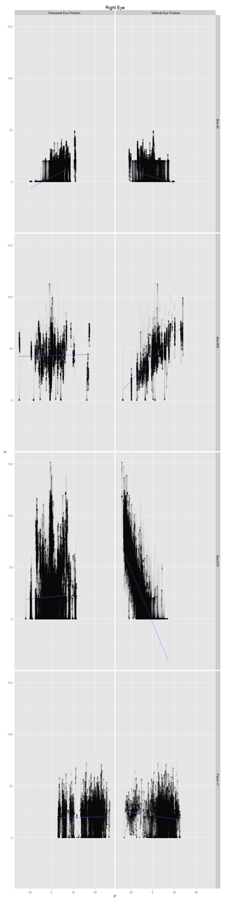

# NPH rate position analysis
Adam  
October 12, 2015  

First I will plot the average firing rate of the neuron while the eyes are in various positions. I've restricted my analysis to periods when the eyes are not in motion using a simple eye velocity threshold. I require both the vertical and horizontal eye position to be less than one. This allows for pre-movement burst activity to potentially interfere with the static analysis. 

 

Next, let's show the rate position curves for horizontal and vertical individually.

 

 

Next, I will create a table of the linear regression coefficients for the formula $$F_r=b+k_hE_h + k_hE_v$$, where $E_h$ and $E_v$ are the horizontal and vertical eye positions during periods where the eye velocity is less than 1.5. 

animal   cellnum    r.h.slope    r.v.slope   r.h.p       r.v.p     r.angle   l.h.slope    l.v.slope   l.h.p      l.v.p     l.angle
-------  --------  ----------  -----------  ------  ----------  ----------  ----------  -----------  ------  ---------  ----------
Bee      909        0.0897372    1.1063768       0   0.0000000    85.36294   0.0996076    1.1719694       0   0.00e+00    85.14201
Bee      910        0.0586779   -2.5296989       0   0.0000000   -88.67123   0.0841864   -2.4950201       0   0.00e+00   -88.06747
Patos    11         0.0776148   -0.0523454       0   0.0095589   -33.99672   0.0957764   -0.0873672       0   5.04e-05   -42.37107

Now, let's plot the vectors of the preferred position for each cell.

 

 

The follwing plot shows the average of the absolute value of the slopes for each animal.

 

In the next analyses, we will evaluate the average firing rate during each period of fixation. First, we identify saccades using a simple velocity threshold and mark them using a buffer of 15ms. The remaining periods are considered fixations.

 

  

  
