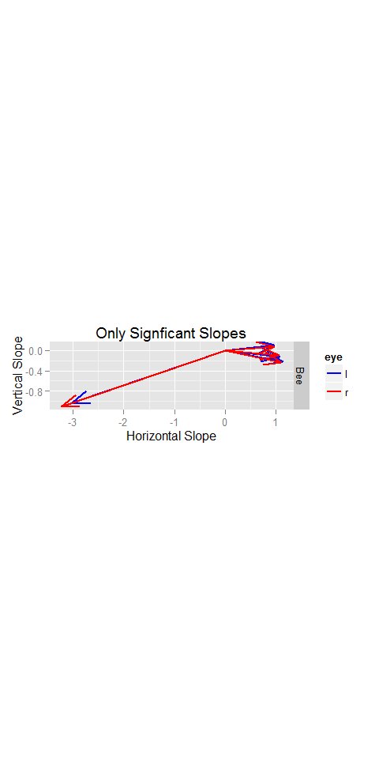

# NPH rate position analysis
Adam  
October 5, 2015  


```r
library(ggplot2)
library(dplyr)
library(knitr)
library(tidyr)
library(grid)
```


```r
#load all the .csv files in the data folder, then add a column naming the neuron, 
#using the file name as the default name, then put them all together in one long data frame

#path<-"~/GitHub/NPH-Analysis/data/"
path<-"~/GitHub/NPH-Analysis/testdata/"
files <- list.files(path=path,pattern='*.csv')
t<-data.frame()
for (i in 1:length(files)) {
  temp <- read.csv(paste(path,files[i],sep=''))
  temp$neuron<-gsub('.csv','',files[i])
  t <-rbind(t,temp)
}
```

First I will plot the average firing rate of the neuron while the eyes are in various positions. I've restricted my analysis to periods when the eyes are not in motion using a simple eye velocity threshold. I require both the vertical and horizontal eye position to be less than one. This allows for pre-movement burst activity to potentially interfere with the static analysis. 


```r
thresh=1.5 #points with velocity below threshold are considered fixation

#choose just the points of fixation, then bin the data into 1 degree bins (using round)
#and calculate the mean firing rate during all the times when the eye is at each position
t %>%
  filter(abs(rev)<thresh,abs(revV)<thresh,abs(lev)<thresh,abs(levV)<thresh) %>%
  mutate(R.Hep=round(rep),R.Vep=round(repV), L.Hep=round(lep),L.Vep=round(lepV)) %>%
  group_by(R.Hep,R.Vep,L.Hep,L.Vep,neuron) %>%
  summarize(fr=mean(sdf)) %>%
  ungroup(.) %>%
  #use tidyr functions to make columns for eye (left or right), vertrical and horizontal eye position
  mutate(time=row_number(fr)) %>%
  gather(temp,P,1:4) %>%
  separate(temp,c("Eye","HV")) %>%
  spread(HV,P) ->
  s
levels(s$Eye)<-c("Right Eye","Left Eye") #Change R/L into Right Eye/Left Eye
```


```r
#Just show cells I want
#s <- filter(s,neuron %in% c("Bee6","BeeX1","BeeX2","BeeX3a","BeeX3b","BeeY1","BeeZ1"))
#s <- filter(s,neuron %in% c("Bee6","BeeZ1"))

#Create a scaled firing rate by simply dividing by the maximum firing rate in any bin
s %>%
  group_by(neuron) %>%
  mutate(maxFR=max(fr),scaledFR=fr/maxFR) ->
  ss

#plot
qplot(Hep,Vep,data=ss,fill=scaledFR)+geom_tile()+facet_grid(neuron~Eye)+
  scale_fill_gradient(low='black',high='orange')
```

 

Next, let's show the rate position curves for horizontal and vertical individually.


```r
t %>%
  filter(abs(rev)<thresh,abs(revV)<thresh,abs(lev)<thresh,abs(levV)<thresh) %>%
  select(1,2,4,6,8,10) %>%
  rename(R.Hep=rep,R.Vep=repV, L.Hep=lep,L.Vep=lepV,fr=sdf) %>%
  #use tidyr functions to make columns for eye (left or right), vertrical and horizontal eye position
  mutate(time=row_number(fr))%>%
  gather(temp,P,2:5) %>%
  separate(temp,c("Eye","HV")) ->
  static
```


```r
static$plotHV<-as.factor(static$HV)
levels(static$plotHV)<-c("Horizontal Eye Position","Vertical Eye Position")

static %>%
  filter(Eye=="R") %>%
  qplot(P,fr,data=.)+facet_grid(neuron~plotHV)+
  ggtitle('Right Eye')+
  stat_smooth(method='lm')
```

 


```r
static %>%
  filter(Eye=="L") %>%
  qplot(P,fr,data=.)+facet_grid(neuron~plotHV)+
  ggtitle('Left Eye')+
  stat_smooth(method='lm')
```

 

Next, I will create a table of the linear regression coefficients for the formula $$F_r=b+k_hE_h + k_hE_v$$, where $E_h$ and $E_v$ are the horizontal and vertical eye positions during periods where the eye velocity is less than 1.5. 


```r
static %>% 
  select(-plotHV) %>%
  spread(HV,P) %>%
  filter(Eye =="R") %>%
  group_by(neuron) %>%
  do(m=summary(lm(fr~Hep+Vep,data=.))$coefficients) %>%
  mutate(r.h.slope=m[2],r.v.slope=m[3],r.h.p=m[11],r.v.p=m[12]) %>%
  select(-m) %>%
  mutate(r.angle=atan2(r.v.slope,r.h.slope)*180/pi) ->
  r

static %>% 
  select(-plotHV) %>%
  spread(HV,P) %>%
  filter(Eye =="L") %>%
  group_by(neuron) %>%
  do(m=summary(lm(fr~Hep+Vep,data=.))$coefficients) %>%
  mutate(l.h.slope=m[2],l.v.slope=m[3],l.h.p=m[11],l.v.p=m[12]) %>%
  select(-m) %>%
  mutate(l.angle=atan2(l.v.slope,l.h.slope)*180/pi) ->
  l

rl<-left_join(r,l,by="neuron")

rl %>% 
  separate(neuron,c("animal","cellnum")) %>%
  arrange(animal,as.numeric(cellnum)) ->
  rl
```

```
## Warning in eval(substitute(expr), envir, enclos): NAs introduced by
## coercion
```

```r
kable(rl)
```


animal   cellnum     r.h.slope    r.v.slope   r.h.p       r.v.p        r.angle    l.h.slope    l.v.slope   l.h.p      l.v.p       l.angle
-------  --------  -----------  -----------  ------  ----------  -------------  -----------  -----------  ------  ---------  ------------
Bee      2           1.1179710   -0.2336401       0   0.0000000    -11.8041138    1.1363488   -0.2182694       0   0.00e+00    -10.872920
Bee      3           1.7297457    0.0061028       0   0.0741130      0.2021458    1.7385816    0.0634959       0   0.00e+00      2.091607
Bee      4           0.9724506    0.0697156       0   0.0000000      4.1005570    0.9745674    0.1055582       0   0.00e+00      6.181770
Bee      5           1.0584261   -0.1012155       0   0.0000000     -5.4624872    1.0738576   -0.1266763       0   0.00e+00     -6.727735
Bee      1a         -3.2353738   -1.1070127       0   0.0000000   -161.1111491   -3.0234150   -1.0345990       0   0.00e+00   -161.109284
Patos    11          0.0776148   -0.0523454       0   0.0095589    -33.9967237    0.0957764   -0.0873672       0   5.04e-05    -42.371071

Now, let's plot the vectors of the preferred position for each cell.

```r
rl %>%
  select(c(1,2,3,4,8,9)) %>%
  gather("type","slope",3:6) %>%
  separate(type,c("eye","HV","x")) %>%
  select(-x) %>%
  spread(HV,slope)%>%
  ggplot(.) +
  geom_segment(aes(x=0,xend=h,y=0,yend=v,col=eye),size=1.0,arrow=arrow(20))+
  facet_grid(animal~.)+
  xlab("Horizontal Slope")+
  ylab("Vertical Slope") +
  scale_color_manual(values=c("blue","red"))+
  coord_cartesian(xlim=c(-3.5,3.5),ylim=c(-3.5,3.5)) +
  coord_fixed()
```

 


```r
rl %>%
  filter(r.h.p<0.001, r.v.p<0.001) %>%
  select(c(1,2,3,4,8,9)) %>%
  gather("type","slope",3:6) %>%
  separate(type,c("eye","HV","x")) %>%
  select(-x) %>%
  spread(HV,slope)-> 
  p
if (nrow(p)> 0) { #make sure at least one cell is significant
  ggplot(p) +
  geom_segment(aes(x=0,xend=h,y=0,yend=v,col=eye),size=1.0,arrow=arrow(20))+
  facet_grid(animal~.)+
  xlab("Horizontal Slope")+
  ylab("Vertical Slope") +
  scale_color_manual(values=c("blue","red"))+
  coord_cartesian(xlim=c(-3.5,3.5),ylim=c(-3.5,3.5)) +
  coord_fixed()+
  ggtitle("Only Signficant Slopes")
}
```

 
